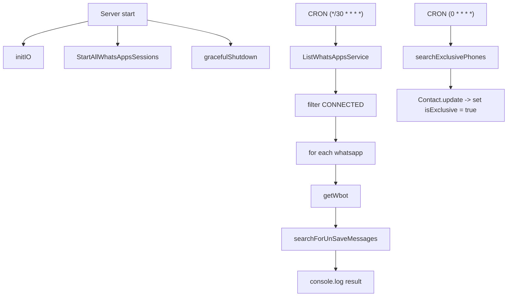
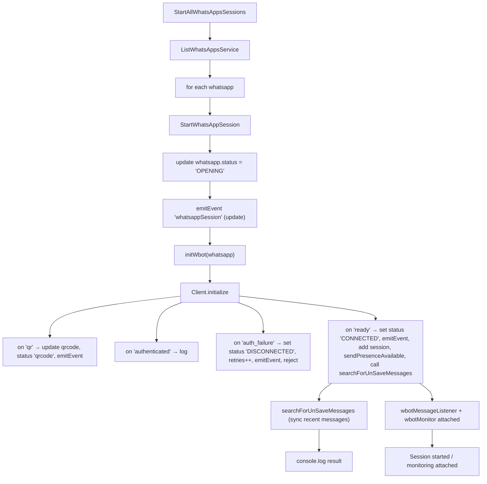
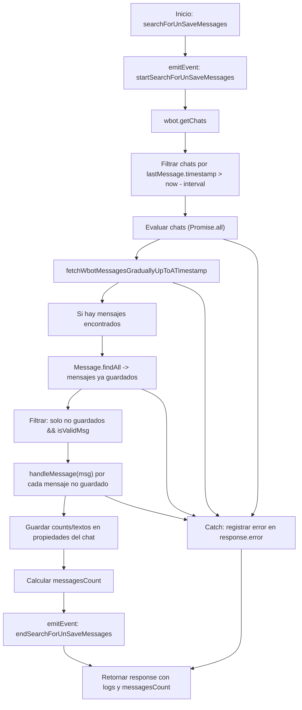

# 05_flujo_inicio_whatrestaurant

## server.ts

Aca empieza la aplicacion

1. Empieza las sesiones de wpp llamando a StartAllWhatsAppsSessions
2. Deja corriendo los crons de searchForUnSaveMessages y searchExclusivePhones

--- 

## StartAllWhatsAppsSessions

Basicamente inicializa el cliente de wwebjs con las configuraciones dadas y maneja los cambios de estado del mismo

## searchForUnSaveMessages

Metodo principal de sincronizacion de mensajes, este se ejecuta cuando la conexion se conecta y en un cron cada media hora
OJO: Este se ejecuta cada media hora pq la liberia no es perfecta y a veces se pueden perder un mensaje que otro si no se sicroniza a cada rato

## searchForUnSaveMessages

Como se refleja en el diagrama del flujo principal, solo checa en microservice por los contactos que son exclusivos y los actualiza de en la bd de nosotros
